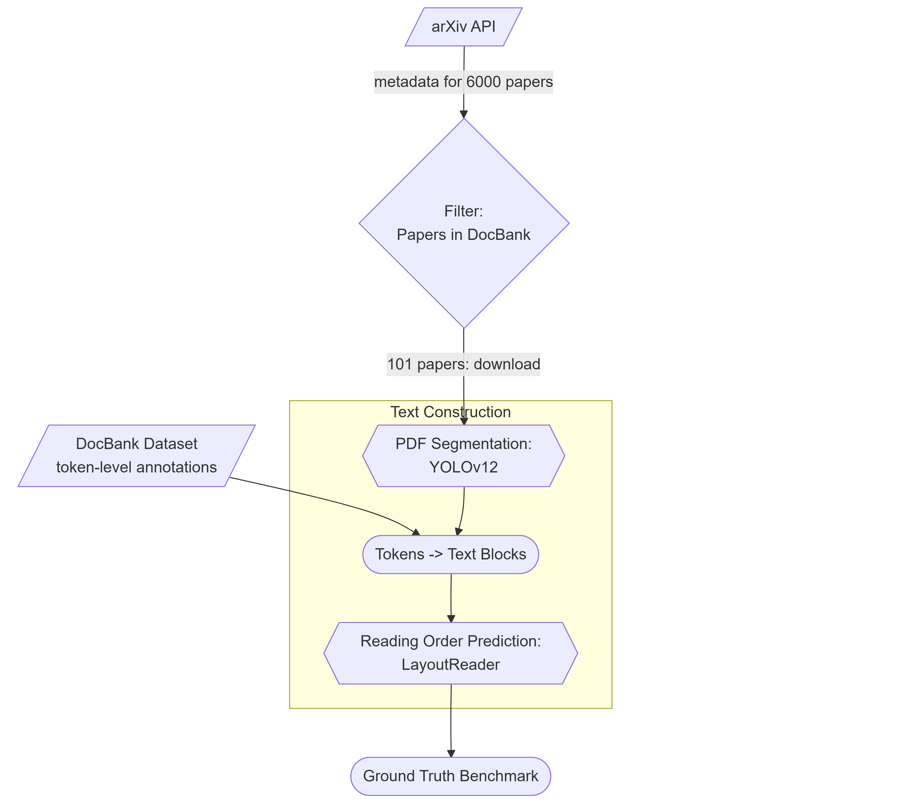

# Layout-Aware Metadata Extraction Framework

This is a theoretical documentation of the thesis research project. For executing the experiments, refer to: [CODE](./CODE.md).

## Table of contents
1. [Introduction](#introduction)
2. [Project Overview](#project-overview)

## Introduction

**Motivation**

Academic publications are the cornerstone of scientific communication, yet their widespread use of PDF formats poses significant challenges for automated metadata extraction. Unlike structured formats such as XML or HTML, PDFs prioritize visual presentation over semantic structure, making it difficult to reliably capture critical bibliographic fields like titles, authors, affiliations, and DOIs.

**Overview**

This project investigates metadata extraction from scholarly PDFs by comparing two paradigms: layout-aware systems, which leverage structural and visual cues, and small-scale language models (SLMs), which rely on contextual reasoning. The work focuses on the construction of high-quality ground-truth datasets, and systematic evaluation of both approaches across accuracy, robustness, and computational efficiency.

Since accurately extracting the linear reading order of text from PDF documents is a prerequisite for downstream metadata extraction, this work also includes benchmarking of PDF parsers.

**Highlights**

* **Ground-Truth Resources** – Provides two curated datasets:
  * A page-level benchmark from DocBank for PDF parser evaluation.
  * A gold-standard collection of metadata for scholarly PDFs.
* **Parser Benchmarking** – Assesses five open-source PDF parsers on text fidelity, completeness, and logical reading order.
* **SLM Pipeline** – Demonstrates metadata extraction using prompt-engineered, schema-constrained outputs without model retraining.
* **Baseline Comparison** – Benchmarks layout-aware GROBID against SLM-based pipelines for accuracy, efficiency, and robustness.

**Metadata Fields**

Title, Authors, Affiliations, Email IDs, Publisher, Publication Date, DOI, Keywords, and Abstract.

---

## Project Overview

### Ground Truth for PDF Text Extraction

Accurate metadata extraction from scholarly PDFs requires a reliable textual representation, yet challenges such as publisher-specific layouts, multi-column formatting, and parser limitations make this non-trivial. To enable rigorous benchmarking of open-source PDF parsers, a ground-truth dataset that captures real-world document variability is constructed.

* **Source Dataset** – Built on the [DocBank corpus](https://doc-analysis.github.io/docbank-page) with token-level annotations (fonts, bounding boxes, textual content). From 500K pages, a curated subset of **101 first pages of arXiv papers (2014–2018)** was selected across disciplines (CS, statistics, mathematics, EE, economics).
* **Sampling Strategy** – Papers were chosen as the intersection of arXiv metadata and DocBank annotations, ensuring coverage of diverse layouts and styles while maintaining token-level precision.
* **Text Construction** – Token annotations were aggregated into structural blocks via a [YOLO-DocLayNet](https://github.com/ppaanngggg/yolo-doclaynet) document layout detector, then ordered using [LayoutReader](https://github.com/ppaanngggg/layoutreader) (based on LayoutLM) to reconstruct a natural reading sequence.
* **Evaluation Benchmark** – This dataset serves as the reference transcript for assessing five open-source parsers: `PyMuPDF`, `pypdfium2`, `pdfminer.six`, `PyPDF2`, and `pdfalto`.

The resulting benchmark enables **quantitative, reproducible comparison** of text extraction fidelity, providing a foundation for downstream metadata extraction tasks.

