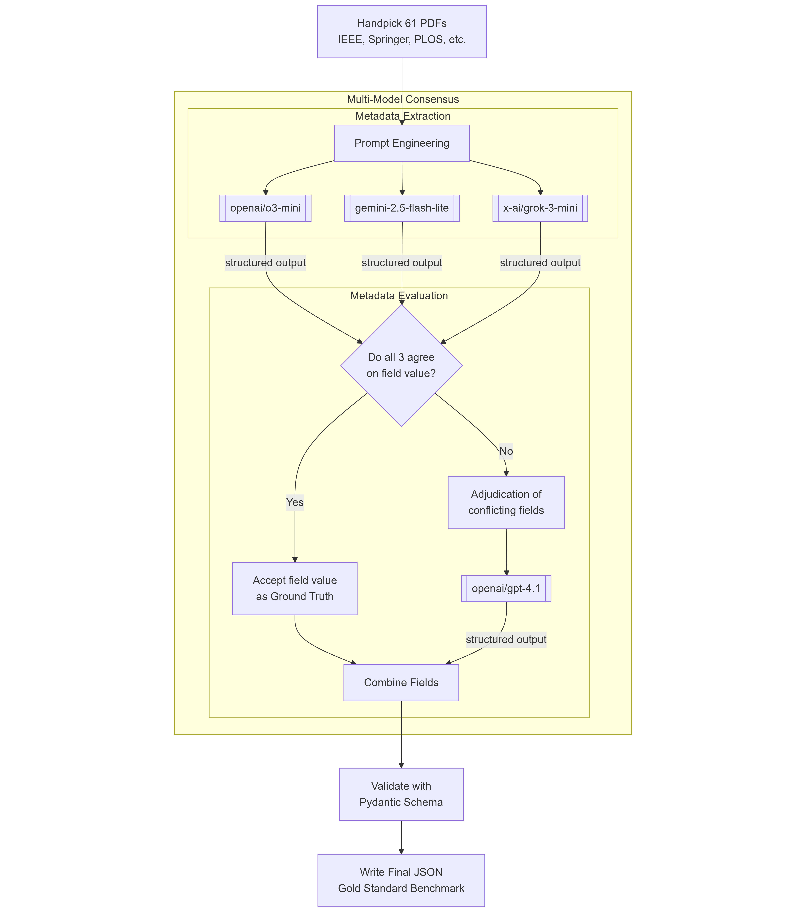
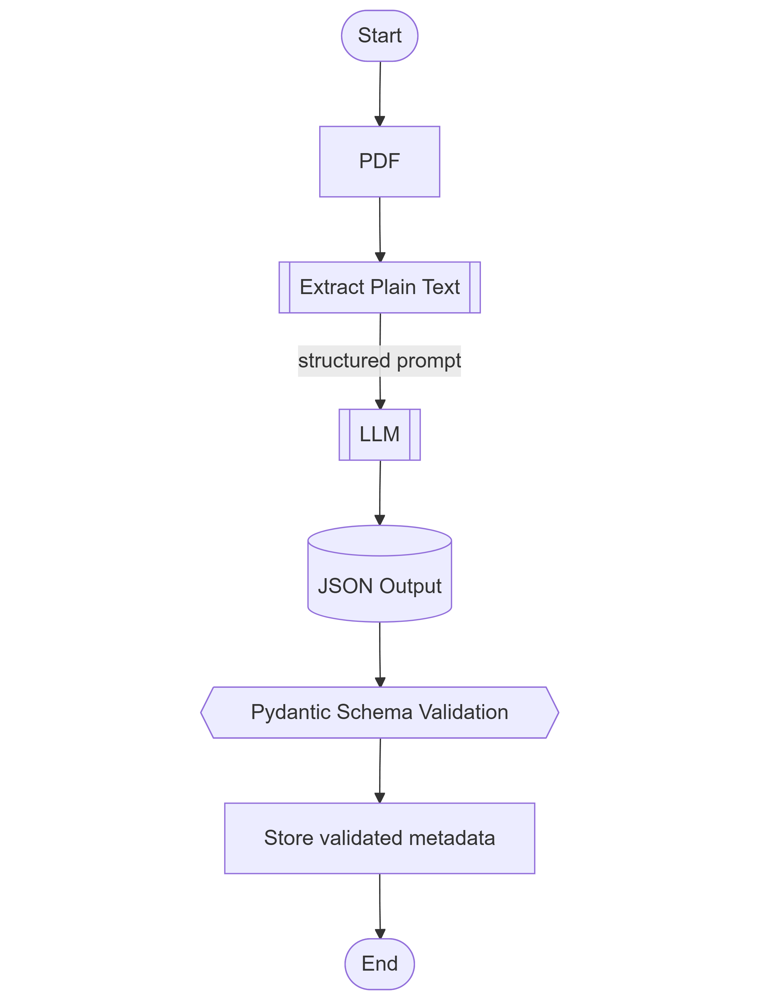

# Layout-Aware Metadata Extraction Framework

This is a theoretical documentation of the thesis research project. For executing the experiments, refer to: [CODE](./CODE.md).

## Table of contents
1. [Introduction](#introduction)
2. [Project Overview](#project-overview)
   1. [Gold Standard Metadata Curation](#gold-standard-metadata-curation)
   2. [Metadata Extraction with GROBID](#metadata-extraction-with-grobid)
   3. [Metadata Extraction with Language Models](#metadata-extraction-with-language-models)
   4. [Ground Truth for PDF Text Extraction](#ground-truth-for-pdf-text-extraction)

## Introduction

**Motivation**

Academic publications are the cornerstone of scientific communication, yet their widespread use of PDF formats poses significant challenges for automated metadata extraction. Unlike structured formats such as XML or HTML, PDFs prioritize visual presentation over semantic structure, making it difficult to reliably capture critical bibliographic fields like titles, authors, affiliations, and DOIs.

**Overview**

This project investigates metadata extraction from scholarly PDFs by comparing two paradigms: layout-aware systems, which leverage structural and visual cues, and small-scale language models (SLMs), which rely on contextual reasoning. The work focuses on the construction of high-quality ground-truth datasets, and systematic evaluation of both approaches across accuracy, robustness, and computational efficiency.

Since accurately extracting the linear reading order of text from PDF documents is a prerequisite for downstream metadata extraction, this work also includes benchmarking of PDF parsers.

**Highlights**

* **Ground-Truth Resources** – Provides two curated datasets:
  * A page-level benchmark from DocBank for PDF parser evaluation.
  * A gold-standard collection of metadata for scholarly PDFs.
* **Parser Benchmarking** – Assesses five open-source PDF parsers on text fidelity, completeness, and logical reading order.
* **SLM Pipeline** – Demonstrates metadata extraction using prompt-engineered, schema-constrained outputs without model retraining.
* **Baseline Comparison** – Benchmarks layout-aware GROBID against SLM-based pipelines for accuracy, efficiency, and robustness.

**Metadata Fields**

Title, Authors, Affiliations, Email IDs, Publisher, Publication Date, DOI, Keywords, and Abstract.

---

## Project Overview

### Gold Standard Metadata Curation

To evaluate metadata extraction methods reliably, this project introduces a **novel multi-model consensus framework** for building a high-quality gold-standard dataset. Instead of relying on manual annotation or a single model, the pipeline systematically leverages diverse LLMs, schema validation, and adjudication to produce accurate and robust metadata records.

* **Document Selection** – 61 diverse born-digital PDFs sampled from publishers including PLOS, Elsevier, Springer, arXiv, PMLR, MDPI, and Frontiers Media to capture heterogeneous layouts and styles.
* **Text Extraction** – PDFs parsed with PyMuPDF into plain text for standardized processing.
* **Structured Outputs** – A Pydantic response schema was passed via the API call to enforce JSON-formatted responses with mandatory bibliographic fields.
* **Multi-Model Annotations** – Metadata independently extracted by three LLMs: o3-mini, Gemini-2.5-flash-lite (Google), and Grok-3-mini (X-AI).
* **Consensus & Adjudication** – Fields with full agreement were accepted; disagreements escalated to GPT-4.1, which resolved only the contested fields using contextual reasoning.
* **Validation** – All outputs passed through Pydantic schema checks to enforce type correctness, field coverage, and structural consistency.
* **Final Benchmark** – Unified, machine-readable JSON records serving as a reliable reference for downstream evaluation.

This framework demonstrates how **AI diversity, consensus, and selective adjudication** can replace labor-intensive manual annotation while improving robustness and generalizability. The resulting dataset offers a scalable and reproducible benchmark for metadata extraction research.

---

### Metadata Extraction with GROBID

This project integrates [GROBID](https://github.com/kermitt2/grobid) for **layout-aware metadata extraction** from scholarly PDFs. GROBID is deployed in Docker and accessed via its REST API using the official Python client.

**Deployment**

Two Docker images are supported:

* **Full image** (`grobid/grobid:0.8.2-full`, \~8GB) – includes deep learning + CRF models, higher accuracy, supports GPU (but CPU-only in this setup).
* **Lightweight image** (`lfoppiano/grobid:0.8.2-crf`, \~500MB) – CRF-only, faster and smaller, lower accuracy for references and citations.

**Workflow**

1. **Input PDFs** are submitted to the GROBID server via the Python client.
2. **Metadata extraction** uses `processHeaderDocument`, returning results in TEI-XML format.
3. **Parsing** with `lxml` + XPath extracts fields (title, authors, affiliations, publication date, publisher, DOI, keywords, abstract).
   * Dates are normalized to `DD-MM-YYYY`.
   * Missing fields (e.g., emails not supported by GROBID) are filled as empty strings.
4. **Output** is written to structured JSON files for downstream analysis.

---

### Metadata Extraction with Language Models

This project implements **language model–based metadata extraction** to compare against layout-aware systems like GROBID. Transformer-based models were used to extract bibliographic fields directly from raw PDF text.

**Models used:**
* `Qwen/Qwen2.5-3B-Instruct`
* `microsoft/Phi-4-mini-instruct`
* `meta-llama/Llama-3.2-3B-Instruct`
* `GPT-OSS-20B` (served via [Ollama](https://ollama.com/))

**Inference optimizations:**
* 4-bit quantization via `BitsAndBytesConfig` for memory-efficient GPU usage.
* PyTorch monitoring of memory and execution time (`torch.cuda.max_memory_reserved`).

**PDF text extraction:**
* First page extracted with PyMuPDF, since it reliably contains bibliographic metadata while reducing token overhead.
* Only gpt-oss was able to handle two pages of extracted text and reliably give structured response.

**Workflow**

* **System prompts** included an explicit JSON schema defining required metadata fields.
* **User prompts** provided the extracted extracted text from PDF in a chat-style template.
* **Model outputs** were expected in structured JSON, validated against a **Pydantic schema** to ensure type correctness and required field coverage.
* **Error handling:** Incomplete or malformed outputs were caught and replaced with empty defaults to maintain consistency.

---

### Ground Truth for PDF Text Extraction

Accurate metadata extraction from scholarly PDFs requires a reliable textual representation, yet challenges such as publisher-specific layouts, multi-column formatting, and parser limitations make this non-trivial. To enable rigorous benchmarking of open-source PDF parsers, a ground-truth dataset that captures real-world document variability is constructed.

A curated subset of **101 first pages of arXiv papers (2014–2018)** was selected across disciplines (CS, statistics, mathematics, EE, economics).

* **Source Dataset** – Built on the [DocBank corpus](https://doc-analysis.github.io/docbank-page) with token-level annotations (fonts, bounding boxes, textual content).
* **Sampling Strategy** – Papers were chosen as the intersection of arXiv metadata and DocBank annotations, ensuring coverage of diverse layouts and styles while maintaining token-level precision.
* **Text Construction** – Token annotations were aggregated into structural blocks via a [YOLO-DocLayNet](https://github.com/ppaanngggg/yolo-doclaynet) document layout detector, then ordered using [LayoutReader](https://github.com/ppaanngggg/layoutreader) (based on LayoutLM) to reconstruct a natural reading sequence.
* **Evaluation Benchmark** – This dataset serves as the reference transcript for assessing five open-source parsers: `PyMuPDF`, `pypdfium2`, `pdfminer.six`, `PyPDF2`, and `pdfalto`.

The resulting benchmark enables **quantitative, reproducible comparison** of text extraction fidelity, providing a foundation for downstream metadata extraction tasks.

---