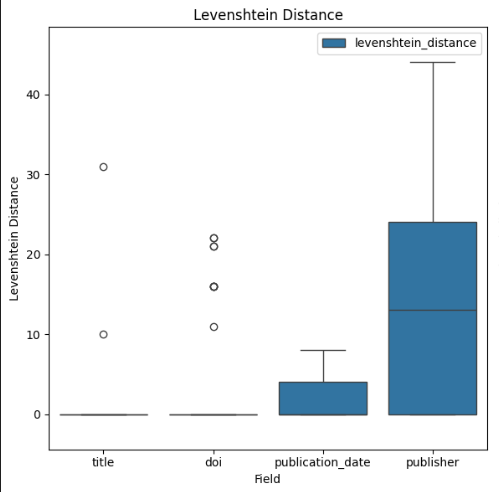
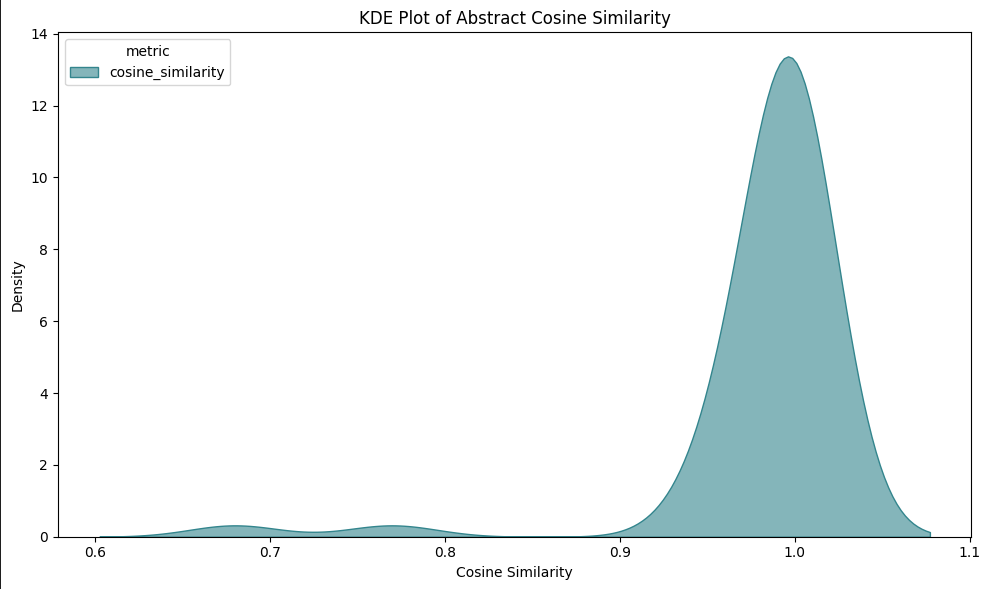
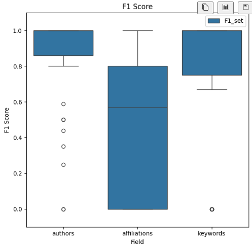

# **Metadata Extraction From Publications**

## **Problem Statement**

Develop an automated method that reliably extracts core metadata—**title, authors, affiliations, email IDs, DOI, publication date, publisher, keywords, and abstract**—from born-digital academic PDFs whose layouts vary widely across publisher styles (e.g., IEEE, Springer) and column structures. The solution must overcome layout heterogeneity to deliver metadata that is both complete and consistently structured for downstream use.

## **Data**

| Step                        | Procedure                                                                                                                                                                               |
| --------------------------- | --------------------------------------------------------------------------------------------------------------------------------------------------------------------------------------- |
| **Corpus selection**        | 50 born-digital PDF articles drawn from seven publishers—PLOS, Elsevier, arXiv, Springer, PMLR, MDPI, and Frontiers Media—to ensure layout diversity.                                   |
| **Initial text extraction** | Parsed each PDF with **PyMuPDF** to obtain the full plain-text content.                                                                                                                 |
| **Metadata triangulation**  | Supplied the extracted text to three lightweight LLMs—`openai/o3-mini`, `google/gemini-2.5-flash-lite`, and `x-ai/grok-3-mini`—each prompted to return the nine target metadata fields. |
| **Agreement filtering**     | Retained any field whose value **exactly matched across all three models** as ground truth.                                                                                             |
| **Discrepancy resolution**  | For fields with conflicting outputs, forwarded the three candidate values to `openai/gpt-4.1`, requesting a single corrected value.                                                     |
| **Structured storage**      | Consolidated the final, reconciled metadata into a **JSON** record per document for downstream evaluation.                                                                              |

## **GROBID Pipeline**

* Deployed GROBID (DL+CRF model) in Docker and called the `processHeader` service to convert each of the 50 PDFs into TEI‐XML header sections.
* Parsed this TEI header to extract all target metadata **except e-mail addresses** (no support).

### **Results**
|    | field            |               metric |   average_score |
|---:|:-----------------|---------------------:|----------------:|
|  1 | title            | levenshtein_distance |        0.836735 |
|  2 | doi              | levenshtein_distance |        3.28571  |
|  3 | publication_date | levenshtein_distance |        1.81633  |
|  4 | publisher        | levenshtein_distance |       14.7755   |
|  5 | abstract         |   consine_similarity |        0.982245 |
|  6 | affiliations     |             f1_score |        0.459592 |
|  7 | authors          |             f1_score |        0.86898  |
|  8 | keywords         |             f1_score |        0.782245 |

