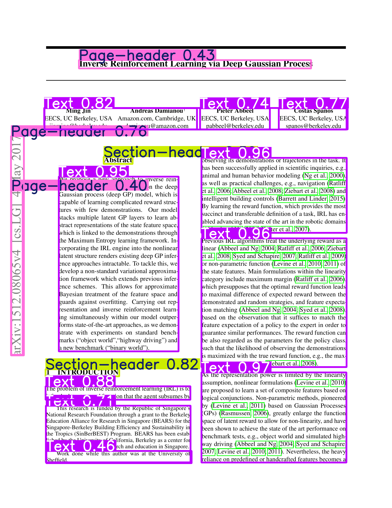
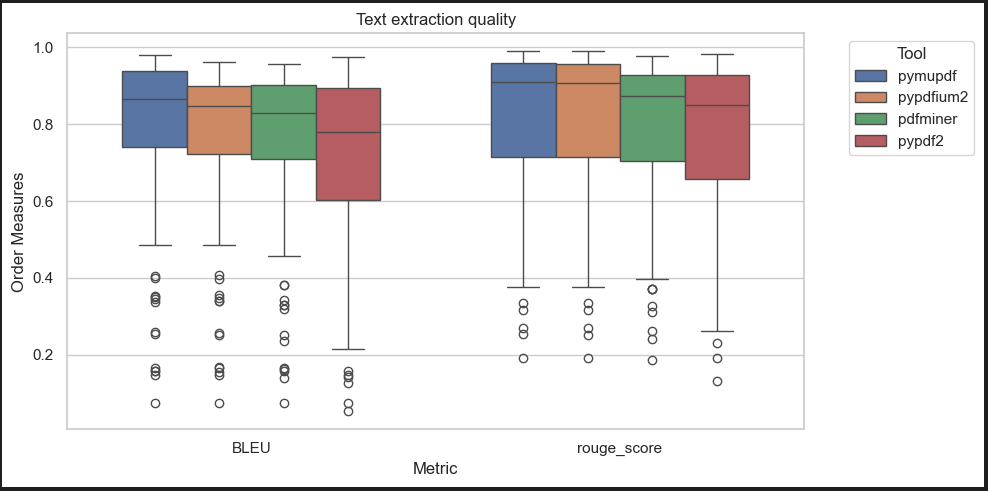
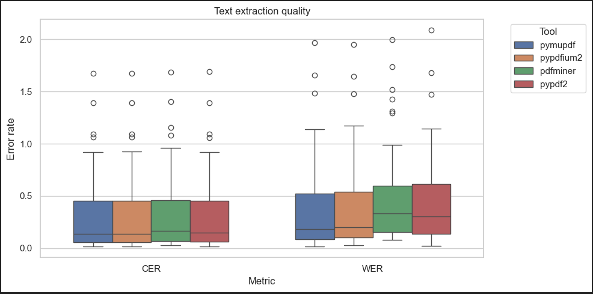

# **Text Extraction From PDF**

## **Problem Statement**

Accurate metadata extraction from born-digital academic PDFs depends on first obtaining a complete, correctly ordered textual representation of each document’s contents. This task is complicated by:

* **Heterogeneous publisher templates:** (e.g., IEEE, Springer) that differ in font usage, heading conventions, and artifact placement.
* **Variable page layouts:** single-column, multi-column, or hybrid—that break naive top-to-bottom reading order.
* **Parser-specific limitations:** in handling encoded characters, ligatures, figures, footnotes, and incremental updates inside the PDF file structure.

The immediate goal is therefore to identify which open-source parsing library - **PyMuPDF**, **pypdfium2**, **pdfminer.six**, or **PyPDF2** delivers the highest fidelity text extraction on *first pages* of arXiv papers representing diverse layouts and styles.

“Highest fidelity” will be quantified against a manually verified ground-truth transcript using four automated text-similarity measures:

1. **Character Error Rate (CER)** – percentage of character insertions, deletions, and substitutions.
2. **Word Error Rate (WER)** – percentage of word-level insertions, deletions, and substitutions.
3. **BLEU Score** – n-gram precision–based overlap between extracted text and reference.
4. **ROUGE-L** – longest-common-subsequence recall and precision, capturing sentence-level ordering.

## **Data**

| Aspect                         | Detail                                                                                                                                                                                                                                                                                                          |
| ------------------------------ | --------------------------------------------------------------------------------------------------------------------------------------------------------------------------------------------------------------------------------------------------------------------------------------------------------------- |
| **Source dataset**             | **DocBank**—token-level annotations (bounding box, font, text) for arXiv papers published 2014-2018.                                                                                                                                                                                                            |
| **Rationale**                  | *Born-digital academic PDFs* with ground-truth tokens; diverse layouts and publisher styles.                                                                                                                                                                                                                    |
| **Selection method**           | 1. Queried arXiv API for 5 disciplines (CS, Stats, Math, EESS, Econ).<br>2. Cross-referenced results with DocBank to keep only papers with existing annotations.<br>3. Downloaded PDFs + annotations for **101 papers** (distribution: CS 31, Stat 22, Math 18, EESS 18, Econ 12).                              |
| **Reading-order ground truth** | 1. **YOLOv12** segments each page into logical blocks.<br>2. Group DocBank tokens by detected segments.<br>3. Feed segments + unassigned tokens into **LayoutReader** (LayoutLM-based seq2seq) to predict inter-segment reading order.<br>4. Concatenate ordered tokens to obtain full reference text per page. |

<div style="page-break-after: always;"></div>

**DocBank Annotations**
> token | boundingbox ((x0, y0), (x1, y1)) - > (x0, y0, x1, y1) | color (R, G, B) | font | label
```
Inverse	201	111	275	134	0	0	0	RQRKXE+NimbusRomNo9L-Medi	title
Reinforcement	280	111	428	134	0	0	0	RQRKXE+NimbusRomNo9L-Medi	title
```

**Example output from YOLO**



## **Results**

**PyMuPdf**
* avg_BLEU=0.7817  
* avg_rouge_score=0.8086



**PyMuPdf**
* avg_CER=0.2805  
* avg_WER=0.3544  



